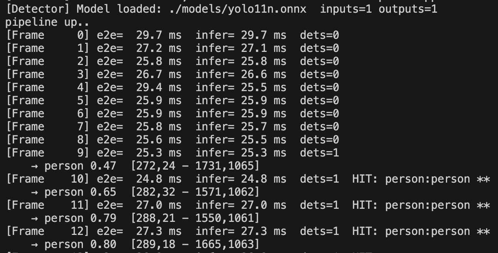

# Edge CV
low latency computer vision pipeline

1. **Ingest** openCV `VideoCapture` usb cam idx / .mp4
2. **Path** capture thread feeds drop-old queue. Frames move via `std::move` into processing thread.
3. **Inference** onnx config: letterbox + CHW preprocess, NMS inside detector
4. **Post-process** class filter (person / vehicle), confidence floor, in-mem watchlist correlation. `Alert`:{ bounding box, confidence, timestamp,  e2e latency }

## Requirements

- CMake ≥ 3.20
- C++20 compiler

```bash
brew install opencv onnxruntime
# NVIDIA pkgs on Jetson
```

### Model

```bash
./scripts/download_model.sh
```

## Build

```bash
mkdir build && cd build

cmake .. -DOpenCV_DIR=/opt/homebrew/Cellar/opencv/5.0.0_5 -DONNXRUNTIME_ROOT=/opt/homebrew/Cellar/onnxruntime/1.29.0_2 -DCMAKE_BUILD_TYPE=Release
make -j
```

## Run

```bash
# usb cam 0
./edge_cv 0 models/yolo11n.onnx

# Video file
./edge_cv /path/to/video.mp4 models/yolo11n.onnx
```


## letterbox resize

is a preprocessing technique used by yolo. Instead of stretching an image to network input size (eg 640×640) the image is resized while preserving aspect ratio.
The remaining area is filled with a constant color (eg gray = 114).

### this avoids distorting objects:
- preprocess() computes a scale factor
- resizes
- pads with (114, 114, 114)
- undoes padding + scale in postprocess()

## CHW 
channel – height – width layout

Most PyTorch networks expect tensor shape:text[batch, channels, height, width] eg 1×3×640×640
opencv images are HWC (Height – Width – Channel)

### preprocess() converts
- BGR → RGB
- normalizes to [0, 1]
- rearranges the data from HWC → CHW (memcpy loop writes each channel contiguously)

## NMS non maximum suppression

If the model outputs many overlapping bounding boxes for the same object, NMS keeps only the best.

### postprocess() sorts:
- boxes by confidence (highest first).
- keep the top box.
- suppress (remove) all other boxes of the same class that have more intersection than threshold.
- repeat with next highest remaining box.