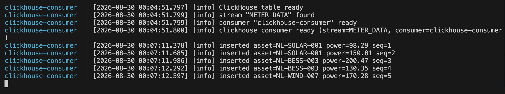

# NATS JetStream + ClickHouse PoC

```
┌─────────────┐     gRPC      ┌──────────────────┐     gRPC      ┌─────────────────────┐
│   Client    │ ────────────► │  IngestService   │ ────────────► │ NatsPublisherService│
│             │               │                  │               │                     │
└─────────────┘               └──────────────────┘               └──────────┬──────────┘
                                                                             │
                                                                             │ JetStream
                                                                             ▼
                                                                   ┌─────────────────┐
                                                                   │  NATS Server    │
                                                                   │  stream:        │
                                                                   │  METER_DATA     │
                                                                   └────────┬────────┘
                                                                            │
                                               ┌────────────────────────────┼
                                               ▼                            ▼
                                        demo-consumer              clickhouse-consumer              (future workers)
                                        (prints readings)          (persists to CH)
```

## Components

| Binary                 | Port / role                                      |
|------------------------|--------------------------------------------------|
| `nats_publisher`       | `:50051` – owns NATS connection, publishes to Jet|
| `ingest_server`        | `:50052` – thin gRPC façade → publisher          |
| `client`               | sends sample solar/wind/BESS readings            |
| `consumer`             | durable JetStream consumer (stdout)              |
| `clickhouse_consumer`  | durable JetStream consumer → ClickHouse          |

## Protobuf layout

```
proto/
├── common/v1/error.proto
├── meter/v1/
│   ├── meter.proto
│   └── ingest_service.proto
└── nats/v1/
    └── publisher_service.proto
```

## Prerequisites (if local build)

- CMake ≥ 3.20
- C++20 compiler (GCC 12+ / Clang 15+)
- protobuf + gRPC dev pkgs

```bash
# Ubuntu example
sudo apt install cmake g++ libprotobuf-dev protobuf-compiler \
  libgrpc++-dev protobuf-compiler-grpc libssl-dev
```

## Build

```bash
cmake -B build -DCMAKE_BUILD_TYPE=Release
cmake --build build -j
```

Binaries in `build/src/`.

## Docker Compose

```bash
docker compose build --no-cache
docker compose up -d
docker compose logs -f nats-publisher consumer clickhouse-consumer

# when publisher shows "stream METER_DATA ready" run:
docker compose run --rm client

docker compose logs -f consumer
docker compose logs -f clickhouse-consumer
```




ClickHouse:

```bash
docker exec -it clickhouse clickhouse-client --password pass \
  -q "SELECT asset_id, active_power_kw, nats_seq, ts FROM meter_readings ORDER BY ts DESC LIMIT 10"
```

## Env

| Variable            | Default                        | Used by                |
|---------------------|--------------------------------|------------------------|
| `NATS_URL`          | `nats://localhost:4222`        | publisher, consumers   |
| `GRPC_ADDR`         | `0.0.0.0:50051` / `:50052`     | publisher / ingest     |
| `PUBLISHER_ADDR`    | `localhost:50051`              | ingest                 |
| `INGEST_ADDR`       | `localhost:50052`              | client                 |
| `CLICKHOUSE_HOST`   | `localhost`                    | clickhouse_consumer    |
| `CLICKHOUSE_PORT`   | `9000`                         | clickhouse_consumer    |
| `CLICKHOUSE_USER`   | `default`                      | clickhouse_consumer    |
| `CLICKHOUSE_PASSWORD` | `pass`                       | clickhouse_consumer    |
| `CLICKHOUSE_DB`     | `default`                      | clickhouse_consumer    |

## Choices

- C++20
- official `nats.c` (JetStream API)
- `clickhouse-cpp`
- `nlohmann/json` + `spdlog`
- CMake FetchContent for missing deps
- protobuf arenas enabled

## TODO

- raw protobuf instead of JSON
- subject hierarchy `meter.reading.<asset_id>`
- batch inserts
- health endpoint
