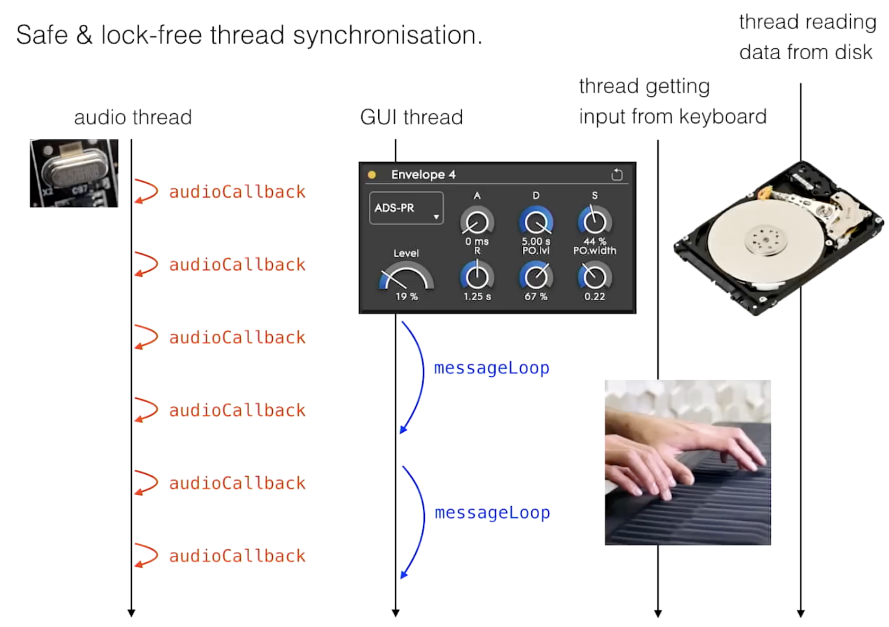

## Lock-free

[](https://www.youtube.com/watch?v=boPEO2auJj4&list=PLoIj7pKHSj4hWDyJuN-k502_A-GxXAiOP)

```sh
➜  cast git:(main) ✗ make run     
clang++ -std=c++17 -Wall -Wextra -pthread -o lock_example main.cpp
./lock_example
Starting lock-free audio demo...
 - Disk thread fills ring buffer
 - Audio thread reads it with zero locks
 - GUI thread changes params via atomics

[GUI] Changing envelope parameters...
[GUI] Lowering level...

Shutdown. Samples remaining in ring_buffer: 4095
```
