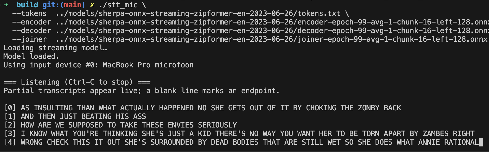

# Mini real-time STT

printing **partial live transcripts** (overwritten on same line)
emitting an empty line when silence is detected.

`mic > portaudio callback > audio queue > sherpa onnx recognizer > partial transcript`



## Prerequisites

```bash
brew install portaudio

git clone https://github.com/k2-fsa/sherpa-onnx && cd sherpa-onnx
mkdir build && cd build   
cmake -DCMAKE_BUILD_TYPE=Release \                                      
      -DBUILD_SHARED_LIBS=ON \
      -DSHERPA_ONNX_ENABLE_C_API=ON \
      -DSHERPA_ONNX_ENABLE_PYTHON=OFF \
      -DSHERPA_ONNX_ENABLE_TESTS=OFF \
      -DSHERPA_ONNX_ENABLE_CHECK=OFF \
      -DSHERPA_ONNX_ENABLE_PORTAUDIO=OFF \
      -DSHERPA_ONNX_ENABLE_WEBSOCKET=OFF \
      -DCMAKE_INSTALL_PREFIX=$HOME/local/sherpa-onnx \
      ..
cmake --install . --prefix $HOME/local/sherpa-onnx  

export DYLD_LIBRARY_PATH=$HOME/local/sherpa-onnx/lib:$DYLD_LIBRARY_PATH
export SHERPA_ONNX_ROOT=$HOME/local/sherpa-onnx
```

```bash
# english zipformer streaming model ~60MB
./scripts/download_model.sh

# build
mkdir -p build && cd build
cmake .. \        
  -DCMAKE_BUILD_TYPE=Release \
  -DCMAKE_PREFIX_PATH="$(brew --prefix)" \
  -DCMAKE_EXE_LINKER_FLAGS="-L$(brew --prefix portaudio)/lib -L$HOME/local/sherpa-onnx/lib -lsherpa-onnx-cxx-api -lsherpa-onnx-c-api -lonnxruntime"
cmake --build . -j$(nproc)

# run
./stt_mic \
    --tokens  ../models/sherpa-onnx-streaming-zipformer-en-2023-06-26/tokens.txt \
    --encoder ../models/sherpa-onnx-streaming-zipformer-en-2023-06-26/encoder-epoch-99-avg-1-chunk-16-left-128.onnx \
    --decoder ../models/sherpa-onnx-streaming-zipformer-en-2023-06-26/decoder-epoch-99-avg-1-chunk-16-left-128.onnx \
    --joiner  ../models/sherpa-onnx-streaming-zipformer-en-2023-06-26/joiner-epoch-99-avg-1-chunk-16-left-128.onnx
```
### ENV

| Var                           |                                              |
|-------------------------------|----------------------------------------------|
| `SHERPA_ONNX_MIC_DEVICE`      | Force PortAudio device idx                 |
| `SHERPA_ONNX_MIC_SAMPLE_RATE` | Override mic sample rate (default 16000)     |

## Models

For low latency on cpu prefer small int8 [sherpa-onnx pretrained models](https://k2-fsa.github.io/sherpa/onnx/pretrained_models/index.html)